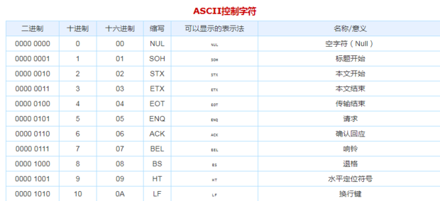
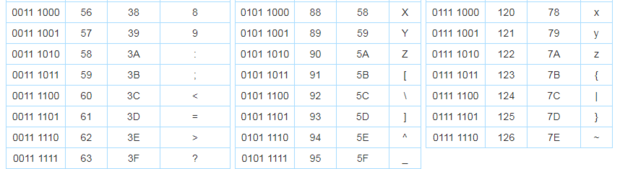

# 计算机基础
主要记录计算机原理及相关基础知识

## 计算机原理

冯诺依曼体系结构计算机的特点是：

1）使用单一的处理部件来完成计算、存储以及通信的工作。

2）[存储单元](https://baike.baidu.com/item/存储单元?fromModule=lemma_inlink)是定长的线性组织。

3）存储空间的单元是[直接寻址](https://baike.baidu.com/item/直接寻址?fromModule=lemma_inlink)的。

4）使用低级[机器语言](https://baike.baidu.com/item/机器语言?fromModule=lemma_inlink)，指令通过[操作码](https://baike.baidu.com/item/操作码?fromModule=lemma_inlink)来完成简单的操作。

5）对计算进行集中的顺序控制。

6）[计算机硬件系统](https://baike.baidu.com/item/计算机硬件系统?fromModule=lemma_inlink)由[运算器](https://baike.baidu.com/item/运算器?fromModule=lemma_inlink)、[存储器](https://baike.baidu.com/item/存储器?fromModule=lemma_inlink)、控制器、输入设备、[输出设备](https://baike.baidu.com/item/输出设备?fromModule=lemma_inlink)五大部件组成并规定了它们的基本功能。

7）采用二进制形式表示数据和指令。

8）在执行程序和处理数据时必须将程序和数据从[外存储器](https://baike.baidu.com/item/外存储器?fromModule=lemma_inlink)装入[主存储器](https://baike.baidu.com/item/主存储器?fromModule=lemma_inlink)中，然后才能使计算机在工作时能够自动调整地从存储器中取出指令并加以执行。

计算机在运行时，先从内存中取出第一条[指令](https://baike.baidu.com/item/指令?fromModule=lemma_inlink)，通过控制器的[译码](https://baike.baidu.com/item/译码?fromModule=lemma_inlink)，按指令的要求，从[存储器](https://baike.baidu.com/item/存储器?fromModule=lemma_inlink)中取出数据进行指定的运算和逻辑操作等加工，然后再按地址把结果送到内存中去

### 指令

一个指令规定计算机执行的一个基本操作，一组指令的集合就是一个程序。计算机的最小存储单元是一个字节也就是8bit也就是8个0/1编码二进制数据。一个程序就是通过一段二进制数据流控制计算机。

### 内存

内存主要分为三种存储器：随机存储器RAM,只读存储器ROM,高速缓存Cache有些分为三级缓存

##### c++ 内存四区

```tex
* 代码区 存放二进制代码           共享 只读
* 全局区 全局变量，常量，静态变量
* 栈区 由编译器自动分配释放，执行代码区方法，存放函数的参数，局部变量
* 堆区 由程序员分配和释放

多线程中并发通过栈区变量地址修改堆区的内存数据，就会出现覆盖的情况。
```

##### 工作内存与主内存

```tex
主内存：
  代码区，堆区
工作内存：
  栈区: 高速缓存中或者寄存器中

线程运行内存为工作内存
```


##### 工作内存与主内存交互8个操作


```te
lock：将主内存变量标识为一条线程独占的状态
unlock：将锁定状态的变量释放出来，其他线程能够去锁定变量
read：将一个主内存变量的值传输到工作内存中，以便随后的load动作使用
load：把read操作从主内存得到的变量值放入工作内存的变量副本中
use：把工作内存中一个变量的值传递给执行引擎使用
assign：把从执行引擎接收到的值赋给工作内存的变量
strore：把工作内存中的一个变量的值传递给主内存，以便随后write操作使用
write：把store操作从工作内存得到的变量值放入主内存的变量中

三大特性
1. 原子性: 同一时刻只能有一个线程来对它操作
   synchronize  lock  atomic
2. 可见性: 一个线程修改了共享变量的值，其它线程立即得知这个修改
   volatile(变量不能自己参与运算)  synchronize final
3. 有序性:是指对于单线程的执行代码，执行是按顺序依次进行的。但在多线程环境中，则可能出现乱序现象，因为在编译过程会出现“指令重排”，重排后的指令与原指令的顺序未必一致
   synchronize volatile
```

### CPU，显卡

##### 硬件结构

```tex
运算器:主要包括算数逻辑单元，寄存器组和状态寄存器
控制器:主要包括程序计数器，指令寄存器，指令译码器，时序产生器和操作控制器

CPU: 架构，频率，缓存
GPU: 架构，显存，频率
```


### 总线 

总线是一组能为多个部件分时共享的公共信息传送线路。分时和共享是总线的两个特点。


### 音频

WAV格式：波形音频文件表示的是一种数字化声音，文件的扩展名为.WAV。

MP3格式：采用国际标准MPEG中的第三层音频压缩模式，对声音信号进行压缩的一种格式，扩展名为.mp3。

MIDI格式：乐器数字化接口，是音乐与计算机结合的产物，文件采用.mid作为扩展名。

### 视频

连续的图像变化每秒超过24帧画面以上时，根据视觉暂留原理，人眼无法辨别单幅的静态画面，看上是平滑连续的视觉效果，这样连续的画面叫做视频。

### 基本概念

　　帧：电视、影像和数字电影中的基本信息单元。

　　剪辑：一部电影的原始素材，在Premiere中，一个剪辑是一个指向硬盘文件的指针。

　　帧速率：描述视频信号的一个重要概念，指每秒刷新的图片的帧数。

　　时基：每秒30帧，即一个一秒长的剪辑包含30帧。

#### 常见格式

AVI格式：调用方便、图像质量好，压缩标准可任意选择，是应用最广泛的格式。

　　MPEG格式：采用了有损压缩方法从而减少运动图像涨冗余信息。主要包括MPEG-1、MPEG-2、MPEG-3、MPEG-4、MPEG-7等。

　　RM格式：一种流媒体视频文件格式。

　　FLV格式：流媒体格式是一种新的视频格式。文件极小、加载速度极快，使得网络观看视频文件成为可能。

信号的A/D和D/A转换及数字视频的压缩和解压缩

#### 数据压缩技术

数据压缩是一种在保持传输帧愿意的基础上减少传输比特数的技术，它对于降低传输费用、减少数据发送时间、提高信道有效利用率等方面具有十分重要的意义。

　　选用合适的数据压缩技术，有可能将字符数据量压缩到原来的1/2左右，语音数据量压缩到原来的1/2-1/10，图像数据量压缩到原来的1/2-1/60。

##### 压缩算法分类

常用的压缩编码可以分为两大类：一类是无损压缩法；另一类是有损压缩法。

1.无损压缩法：去掉或者减少数据中的冗余，但是这些冗余值是可以重新插入到数据中的，因此，无损压缩是可逆的过程。

　总结：无损压缩主要用于文本数据的压缩。WinRAR、WinZip是典型的通用无损压缩软件。.zip、.rar、.tif、.gif、.png等格式的文件采用的是无损压缩技术。

2.有损压缩法：会减少信息量，而损失的信息是不能再恢复的，因此这种压缩法是不可逆的。

   总结：有损 压缩广泛应用于语音 、图像和视频数据的压缩，.jpg、.wmf、.mp3、mpg等格式的文件都采用了有损压缩技术

##### 常用压缩算法

　　1. 文本压缩：
　　　　哈夫曼编码、算术压缩、行程编码、相对编码和Lempel-Ziv编码。

　　2. 图像压缩：
　　　　JPEG和GIF。

　3.视频压缩：
　　　　MPEG。

　4.音频压缩：
　　　　MP3。

##### 流媒体文件格式


​    微软格式：.wma 、.asf

　Real格式：.ra、.rm、.rmvb

　QuickTime格式： .mov、.qt

　Mpeg格式：.dat、mpeg

### 图形图像

图像是指图像、图画、各种照片以及光学影像，是采用绘画或者拍照的方法获得的人、物、景的模拟。

图形是图像的一种抽象，它反映图像的几何特征，例如点、线、面等。

图形不直接描述图像中的每一点，而是描述产生这些点的过程和方法，即矢量图形。

#### 分辨率

图像分辨率是指图像中存储的信息量。

这种分辨率有多种衡量方法，典型的是以每英寸的像素数(ppi)来衡量。图像的分辨率越高，每英寸所含的像素点越多，图像越清晰。

图像尺寸=ppi/dpi (英寸)

比如：一张图像，dpi是200*200，ppi是1000*1000，则其尺寸为1000/200=5英寸。

#### 位图

也叫点阵图，是把一幅彩色图分成许多像素，每一个像素用若干个二进制位来指定该像素的颜色、亮度和属性。

特点：不宜修改、文件大、显示速度快。

#### 矢量图

   用一系列计算机指令来表示一幅画，如画点、画线、画曲线、画圆、画矩形等。

   特点：易于修改、文件小、不宜用于复杂图像。

#### 图像文件大小

　　像素总量=宽度* 高度=分辨率

例如：一张分辨率为1024*768的图像，其像素总量为：

　　1024*786=786432个像素

　　图像文件大小=像素总量*色深(byte)

例如： 一张分辨率1024*768的图像，24位色深，图像文件大小为：

　　1024*768*24/8=2359296byte=2304KB

#### 色彩模式

色彩模式是指计算机为了表示、模拟和描述图像色彩空间的方法，也称色彩(色调)模型。

 常用的色彩模式有：RGB(red, green, blue  红/绿/蓝)色彩模式、

CMYK(cyan青，magenta品红，yellow黄，black黑)色彩模式、

LAB(亮度/绿红/蓝黄)色彩模式、

HSB(色调-饱和度-亮度（Hue–Saturation–Brightness）)

色彩模式；位图模式和灰度模式等

.bmp格式：是在windows系统下使用的与硬件设备无关的基本位图格式文件。
.jpg格式：是一种采用JPEG(联合图片专家组标准)的应用范围非常广泛的图像文件格式。JPEG文件一般采用有损压缩编码技术，支持24位真彩色。
.gif格式：是一种用于Web上常用的文件格式。该文件的数据是采用了无损压缩技术，最多支持256种彩色，占用空间小，在网页制作种可减少下载浏览时间。

.png格式：是一种可携带式网络图片的文件存储格式。该文件采用了比GIF更有效率的无损压缩技术，保留了图像中每个像素，但不支持动画，且比特空间较JPEG和GIF大


## 计算机编码

### 二进制

#### 字节单位

bit Byte KB 

1字节(Byte) = 8位(bit)

1KB( KB，千字节) = 1024B

#### 二进制运算

**注意：计算机都是用补码存储，在计算的时候，如果是减法，可以把减法看成加法。**

* 源码

  +100 = 00000000 00000000 00000000 01100100 

  -100  = 10000000 00000000 00000000 01100100

* 反码

  反码的表示方法是: 正数的反码是其本身，负数的反码是在其原码的基础上，符号位不变，其余各个位取反。

  +100 = 00000000 00000000 00000000 01100100 

  -100  = 11111111 11111111 11111111 10011011

* 补码

  补码的表示方法是：正数的补码就是其本身，负数的补码是在其原码的基础上，符号位不变，其余各位取反，最后+1 (即**在反码的基础上+1**)。

  +100 = 00000000 00000000 00000000 01100100 

  源码  -100  = 10000000 00000000 00000000 01100100

  反码 -100  = 11111111 11111111 11111111 10011011

  补码+1  -100 =  11111111 11111111 11111111 10011100

* 逻辑运算

  - “与”运算：全部为真值(1)才为真。

  - “或”运算：只要存在一个真值(1)就为真(或 全部为假才为假)。

  - “异或”运算：相同为假，不同为真。

  - “非”运算：一变零，零变一。

    **总结：**
    **真真为真(与)，假假为假(或)，同假异真(异或)。**

  - 按位与运算

    例：3 &5  即 00000011 & 00000101 = 00000001 ，所以 3 & 5的值为1。

  - 按位或运算

    例：2 | 4 即 00000010 | 00000100 = 00000110 ，所以2 | 4的值为 6 。

  - 异或运算

    例： 2 ^ 4 即 00000010 ^ 00000100 =00000110 ，所以 2 ^ 4 的值为6 。

  - 左移（<<）

    将6左移2位：6<<2

    0000 0110     十进制6

    0001 1000      左移2位后，低位补0，换算成十进制为24

  - 右移（>>）

    将6右移2位：6>>2

    0000 0110      十进制6

    0000 0001      右移2位后，高位补0，换算成十进制为1

  - 无符号数右移（>>）

    将 6 无符号右移2位：6>>>2

    0000 0110          

    0000 0001           右移2位后，高位补0，换算成十进制为1

    将 -6 无符号右移2位：-6>>>2

    1111 1111 1111 1111 1111 1111 1111 1010   负数都以补码表示

    0011 1111 1111 1111 1111 1111 1111 1110   换算成十进制为1073741822  

  - 非 （~）

    操作数的每一位1变为0，0变为1

    将6非运算：~6

    0000 0110
    1111 1001    换算成十进制为-7

### ASCII

American Standard Code for Information Interchange
美国标准信息交换码

共8位二进制最高位不用默认0     2^7 = 127 个

ASCII 控制符




ASCII 显示字符




### UNICODE

Unicode编码是一种计算机字符编码标准，其实个人认为叫字符集更为准确；而我们熟悉的UTF-8 UTF-16 UTF-32是Unicode的具体实现。

#### 1）Unicode编码规范制定标准：

　　　把世界上所有能出现的字符，都为其分配一个数字来表示，比如，数字U+7F57被分配给了汉字中的"罗"字。Unicode编码的标准里字符数量一直实在新增（包括一些稀有字符，当然emoji表情字符也属于unicode编码哈哈），19年3月刚发布了Unicode12.0版本，比之前的版本新增了一些字符，现在在标准中的字符一共有137929个，而Unicode编码目前规划了**U+0000至U+10FFFF为unicode编码**（以世界上字符的数量应该是很久不会考虑扩展的），算一下目前还剩下976183（1114112-137929）个代码点，这976183个代码点是规划在unicode中的数字，但是还没被分配对应的字符。

#### 2）UTF-8编码：

　　　UTF-8可以说是当前互联网最常用的编码格式了，它基于Unicode字符集进行编码设计。它最大的特点是变长字节的编码设计，一个字符最长4个字节，最少1个字节，大部分的中文字符占3个字节。

　　　编码规则如下：

　　1.用一个字节表示的字符，第一位设为 0，后面的 7 位对应这个字符的 Unicode 码点。由于这128个字符的unicode完全对照ASCII码，可以说完全向下兼容ASCII码。即ASCII编码的文件可以用UTF-8打开而不乱码；

　　2.用一个字节以上表示的字符，假设是N个字节表示这个字符：则该字符第一个字节的前N位都为1，第N+1位为0，剩下的N-1个字节的前两位都设为10，剩下没有主动设值的位置则使用这个字符的Unicode二进制代码点从低位到高位填充，不够用0补足。

　　　编码对照表如下：

| **Unicode字符集范围（十六进制）** | **UTF-8编码（二进制）**             |
| --------------------------------- | ----------------------------------- |
| 0000 0000 - 0000 007F             | 0xxxxxxx                            |
| 0000 0080 - 0000 07FF             | 110xxxxx 10xxxxxx                   |
| 0000 0800 - 0000 FFFF             | 1110xxxx 10xxxxxx 10xxxxxx          |
| 0001 0000 - 0010 FFFF             | 11110xxx 10xxxxxx 10xxxxxx 10xxxxxx |

　　　结合编码规则和编码对照表，讲解汉字“罗”是如何编码和解码的：

　　　**编码（encode）**： 字符“罗”所对应的unicode代码点由以上规则转化为UTF-8所对应的二进制数字，则称为编码。可以理解为使字符成为代码的意思，而解码就是代码成为字符。

　　　首先“罗”对应了unicode中的U+7F57，对应编码表中第三行，也就是用3个字节来表示的字符，把7F57的二进制111 1111 0101 0111‬从低位对应补足到1110xxxx 10xxxxxx 10xxxxxx(从低位) 如下图所示：

　　　最后成为11100111 10111101 10010111即十六进制E7BD97。


　　　**解码（decode）**： UTF-8所对应的二进制数字由以上规则转化为unicode码再对应到具体字符，则称为编码。

　　　如11100111 10111101 10010111这段二进制编码，第一个字节是111，对应编码对照表则这段编码表示的字符由3个字节组成，用1110xxxx 10xxxxxx 10xxxxxx规则剔除出x对应的数为111 1111 0101 0111，即7F57，该数字对应unicode字符集中的字符“罗”。

### 国标码

#### ISO-8859-1  别名 Latin1

[ISO-8859](https://upimg.baike.so.com/doc/24526940-25385919.html)全称**ISO/IEC 8859**，是国际标准化组织(ISO)及国际电工委员会(IEC)联合制定的一系列8位字符集的标准，现时定义了15个字符集。

属于单字节编码，最多能表示的字符范围是0-255，应用于英文系列。比如，字母a的编码为0x61=97。 

很明显，iso8859-1编码表示的字符范围很窄，无法表示中文字符。但是，由于是单字节编码，和计算机最基础的表示单位一致，所以很多时候，仍旧使用iso8859-1编码来表示。而且在很多协议上，默认使用该编码。比如，虽然"中文"两个字不存在iso8859-1编码，以gb2312编码为例，应该是"d6d0 cec4"两个字符（java字符占2个字节），使用iso8859-1编码的时候则将它拆开为4个字节来表示："d6 d0 ce c4"（事实上，在进行存储的时候，也是以字节为单位处理的）。而如果是UTF编码，则是6个字节"e4 b8 ad e6 96 87"。很明显，这种表示方法还需要以另一种编码为基础。

#### GBK/GB2312

 汉字的国标码，专门用来**表示汉字，是双字节编码**, 其中gbk编码能够用来同时表示繁体字和简体字，而**gb2312只能表示简体字**，gbk是兼容gb2312编码的。 